# workshop-cicd
2025.05.31 쿠버네티스 워크샵

## CI/CD 실습 진행 순서
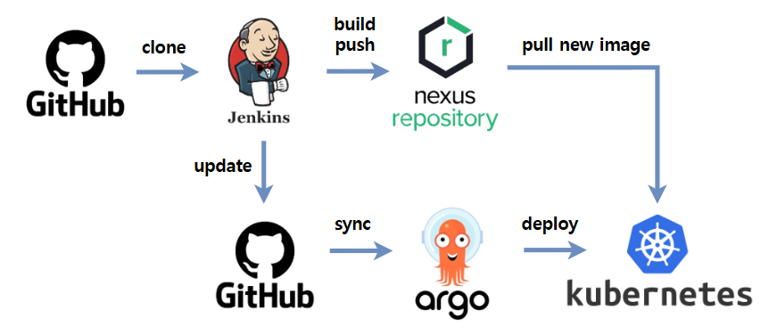

이번 워크샵에서는 

GitHub에 올라온 코드를 기반으로, 

Jenkins가 코드를 가져와 애플리케이션을 빌드하고, 

빌드한 이미지를 Nexus에 저장한 다음, 

ArgoCD가 그 이미지를 감지해서 Kubernetes 클러스터에 자동 배포하는 

CI/CD 과정을 실습 해보겠습니다.

## 0. CI/CD란?

### CI란? (지속적 통합, Continuous Integration)
코드를 병합한 뒤, 자동으로 테스트하고 애플리케이션을 빌드하는 과정입니다.

### CD란? (지속적 배포, Continuous Delivery/Deployment)
빌드된 애플리케이션 이미지를 서버에 자동으로 배포하는 과정입니다.

---

개발자가 코드를 변경하고, Jenkins에서 빌드를 실행하면,

그 코드가 자동으로 테스트되고, 이미지로 만들어져 서버에 배포되는 일련의 자동화 과정입니다.

---

## 1. NKS Authentication 등록

### 1) ncp-iam-authenticator 설치

- ncp-iam-authenticator 다운로드
```bash
curl -o ncp-iam-authenticator -L https://github.com/NaverCloudPlatform/ncp-iam-authenticator/releases/latest/download/ncp-iam-authenticator_linux_amd64
```
- 바이너리 실행 권한 추가
```bash
chmod +x ./ncp-iam-authenticator
```
- $HOME/bin/ncp-iam-authenticator를 생성하고 PATH에 추가
```bash
mkdir -p $HOME/bin && cp ./ncp-iam-authenticator $HOME/bin/ncp-iam-authenticator && export PATH=$PATH:$HOME/bin
```
- Shell Profile에 PATH 추가
```bash
echo 'export PATH=$PATH:$HOME/bin' >> ~/.bash_profile
```
- 상태 확인
```bash
ncp-iam-authenticator help
```

### 2) IAM 인증 kubeconfig 생성

- OS 환경 변수 설정
```bash
export NCLOUD_ACCESS_KEY=ncp_iam_BGASKRuQuDOD2EQqlIl1
export NCLOUD_SECRET_KEY=ncp_iam_BGKSKR9M5cnaOTM6f16GbMRd5QLi0SiSpK
export NCLOUD_API_GW=https://ncloud.apigw.gov-ntruss.com
```
- configure 파일 생성
```bash
mkdir ~/.ncloud
```
```bash
cd ~/.ncloud
```
```bash
cat <<EOF > ~/.ncloud/configure
[DEFAULT]
ncloud_access_key_id = ncp_iam_BGASKRuQuDOD2EQqlIl1
ncloud_secret_access_key = ncp_iam_BGKSKR9M5cnaOTM6f16GbMRd5QLi0SiSpK
ncloud_api_url = https://ncloud.apigw.gov-ntruss.com

[project]
ncloud_access_key_id = ncp_iam_BGASKRuQuDOD2EQqlIl1
ncloud_secret_access_key = ncp_iam_BGKSKR9M5cnaOTM6f16GbMRd5QLi0SiSpK
ncloud_api_url = https://ncloud.apigw.gov-ntruss.com
EOF
```
- kubeconfig 생성
```bash
ncp-iam-authenticator create-kubeconfig --region KR --clusterUuid <클러스터uuid> --output kubeconfig.yaml
```
- 클러스터 확인
```bash
kubectl get nodes --kubeconfig=/root/.ncloud/kubeconfig.yaml
```

### 3) alias 등록

```bash
alias k='kubectl --kubeconfig=/root/.ncloud/kubeconfig.yaml'
```

## 2. Jenkins 생성
**Jenkins**란?
코드를 빌드하고 테스트해서 애플리케이션을 만들 수 있도록 도와주는 자동화 도구입니다.

### 0) Namespace 생성
```bash
k create namespace jenkins
```

jenkins manifest 파일을 모을 폴더 생성
```bash
mkdir -p ~/manifest/jenkins
```
```bash
cd ~/manifest/jenkins
```

### 1) Storage Class 생성
**Storage Class란?**

쿠버네티스에서 “어떤 성능과 방식의 저장공간을 자동으로 만들지” 정해주는 설정입니다.

```bash
vi sc.yaml
```

```yaml
apiVersion: storage.k8s.io/v1
kind: StorageClass
metadata:
  name: jenkins-sc                         # PVC에서 사용할 StorageClass 이름
provisioner: blk.csi.ncloud.com            # Naver Cloud용 Block Storage CSI 드라이버
parameters:   
  type: SSD                                # 저장소 타입 : SSD
reclaimPolicy: Retain                      # PVC 삭제 시 볼륨을 남겨둠
volumeBindingMode: WaitForFirstConsumer    # 실제로 Pod가 만들어져야 볼륨도 생성됨
```

```bash
k apply -f sc.yaml
```

```bash
k get sc
```

```bash
root@ehyang-w-3c0c:~/manifest/jenkins# k get sc
NAME                          PROVISIONER          RECLAIMPOLICY   VOLUMEBINDINGMODE      ALLOWVOLUMEEXPANSION   AGE
jenkins-sc                    blk.csi.ncloud.com   Retain          WaitForFirstConsumer   false                  26s
nks-block-storage (default)   blk.csi.ncloud.com   Delete          WaitForFirstConsumer   true                   16h
nks-nas-csi                   nas.csi.ncloud.com   Delete          WaitForFirstConsumer   true                   16h
```

### 2) PersistentVolumeClaim 생성
**PersistentVolumeClaim이란?**

애플리케이션이 쿠버네티스에 “이만큼 저장공간이 필요하다”고 요청하는 자원 요청서입니다.

StorageClass를 참고하여 실제 볼륨이 생성됩니다.

```bash
vi pvc.yaml
```

```yaml
apiVersion: v1
kind: PersistentVolumeClaim
metadata:
  name: jenkins-pvc               # PVC 이름
  namespace: jenkins              # PVC가 속할 네임스페이스
spec:
  accessModes:
    - ReadWriteOnce               # 하나의 노드에서 읽기/쓰기 가능
  storageClassName: jenkins-sc    # 사용할 StorageClass 이름
  resources:
    requests:
      storage: 10Gi               # 요청할 저장공간 용량(10GiB)
```

```bash
k apply -f pvc.yaml
```

```bash
root@ehyang-w-3c0c:~/manifest/jenkins# k get pvc -n jenkins
NAME          STATUS    VOLUME   CAPACITY   ACCESS MODES   STORAGECLASS   VOLUMEATTRIBUTESCLASS   AGE
jenkins-pvc   Pending                                      jenkins-sc     <unset>                 18s
```

### 3) Deployment 생성
**Deployment**란?

애플리케이션을 몇 개의 Pod로 실행할지, 언제 재시작할지 등을 정의하는 실행 관리 설정입니다.

애플리케이션을 안정적으로 배포하고 운영하기 위한 핵심 구성 요소입니다.

```bash
vi deploy.yaml
```

```yaml
apiVersion: apps/v1
kind: Deployment
metadata:
  labels:
    app: jenkins
  name: jenkins
  namespace: jenkins
spec:
  replicas: 1
  selector:
    matchLabels:
      app: jenkins
  template:
    metadata:
      labels:
        app: jenkins
    spec:
      securityContext:
        fsGroup: 1000
      containers:
      - image: kbsys9505/jenkins:2.492-jdk17
        imagePullPolicy: Always
        name: jenkins
        ports:
        - containerPort: 8080
          protocol: TCP
        - containerPort: 50000
          protocol: TCP
        resources:
          limits:
            cpu: 2
            memory: 4Gi
          requests:
            cpu: 1
            memory: 2Gi
        securityContext:
          privileged: true
        volumeMounts:
        - name: jenkins-home
          mountPath: /var/jenkins_home
      volumes:
      - name: jenkins-home
        persistentVolumeClaim:
          claimName: jenkins-pvc
```

```bash
k apply -f deploy.yaml
```

```bash
root@ehyang-w-3c0c:~/manifest/jenkins# k get deploy -n jenkins
NAME      READY   UP-TO-DATE   AVAILABLE   AGE
jenkins   0/1     1            0           28s
```

### 4) Service 생성
**Service**란?

쿠버네티스에서 Pod에 안정적으로 접근할 수 있도록 IP와 포트를 제공해주는 네트워크 설정입니다.

외부 또는 클러스터 내부에서 애플리케이션에 접근할 때 사용됩니다.

```bash
vi svc.yaml
```

```yaml
apiVersion: v1
kind: Service
metadata:
  name: jenkins-svc
  namespace: jenkins
  labels:
    app: jenkins
spec:
  type: NodePort
  ports:
  - port: 8080
    targetPort: 8080
    nodePort: 30080
    name: jenkins-web
  selector:
    app: jenkins
```

```bash
k apply -f svc.yaml
```

### 5) Jenkins 접속

http://[서버공인IP]:30080/

초기비밀번호 위치
/var/jenkins_home/secrets/initialAdminPassword

```bash
cat /var/jenkins_home/secrets/initialAdminPassword
```

ID : admin

PW : clush1234

## 3. Nexus 생성
**Nexus**란?
빌드된 애플리케이션 이미지를 저장하고 관리하는 저장소 서버(이미지 창고)입니다.

### 0) Namespace 생성
```bash
k create namespace nexus
```

jenkins manifest 파일을 모을 폴더 생성
```bash
mkdir -p ~/manifest/nexus
```
```bash
cd ~/manifest/nexus
```

### 1) Storage Class 생성
**Storage Class란?**

쿠버네티스에서 “어떤 성능과 방식의 저장공간을 자동으로 만들지” 정해주는 설정입니다.

```bash
vi sc.yaml
```

```yaml
apiVersion: storage.k8s.io/v1
kind: StorageClass
metadata:
  name: nexus-sc                           # PVC에서 사용할 StorageClass 이름
provisioner: blk.csi.ncloud.com            # Naver Cloud용 Block Storage CSI 드라이버
parameters:   
  type: SSD                                # 저장소 타입 : SSD
reclaimPolicy: Retain                      # PVC 삭제 시 볼륨을 남겨둠
volumeBindingMode: WaitForFirstConsumer    # 실제로 Pod가 만들어져야 볼륨도 생성됨
```

```bash
k apply -f sc.yaml
```

### 2) PersistentVolumeClaim 생성
**PersistentVolumeClaim이란?**

애플리케이션이 쿠버네티스에 “이만큼 저장공간이 필요하다”고 요청하는 자원 요청서입니다.

StorageClass를 참고하여 실제 볼륨이 생성됩니다.

```bash
vi pvc.yaml
```

```yaml
apiVersion: v1
kind: PersistentVolumeClaim
metadata:
  name: nexus-pvc                 # PVC 이름
  namespace: nexus                # PVC가 속할 네임스페이스
spec:
  accessModes:
    - ReadWriteOnce               # 하나의 노드에서 읽기/쓰기 가능
  storageClassName: nexus-sc      # 사용할 StorageClass 이름
  resources:
    requests:
      storage: 10Gi               # 요청할 저장공간 용량(10GiB)
```

```bash
k apply -f pvc.yaml
```

### 3) Deployment 생성
**Deployment**란?

애플리케이션을 몇 개의 Pod로 실행할지, 언제 재시작할지 등을 정의하는 실행 관리 설정입니다.

애플리케이션을 안정적으로 배포하고 운영하기 위한 핵심 구성 요소입니다.

```bash
vi deploy.yaml
```

```yaml
apiVersion: apps/v1
kind: Deployment
metadata:
  labels:
    app: nexus
  name: nexus
  namespace: nexus
spec:
  replicas: 1
  selector:
    matchLabels:
      app: nexus
  template:
    metadata:
      labels:
        app: nexus
    spec:
      securityContext:
        fsGroup: 1000
      containers:
      - image: sonatype/nexus3:3.52.0
        imagePullPolicy: Always
        name: nexus
        ports:
        - containerPort: 8081
          protocol: TCP
          name: nexus-web
        - containerPort: 5000
          protocol: TCP
          name: nexus-docker
        resources:
          limits:
            cpu: 2
            memory: 4Gi
          requests:
            cpu: 1
            memory: 2Gi
        volumeMounts:
        - name: nexus-data
          mountPath: /nexus-data
      volumes:
      - name: nexus-data
        persistentVolumeClaim:
          claimName: nexus-pvc
```

```bash
k apply -f deploy.yaml
```

### 4) Service 생성
**Service**란?

쿠버네티스에서 Pod에 안정적으로 접근할 수 있도록 IP와 포트를 제공해주는 네트워크 설정입니다.

외부 또는 클러스터 내부에서 애플리케이션에 접근할 때 사용됩니다.

```bash
vi svc.yaml
```

```yaml
apiVersion: v1
kind: Service
metadata:
  name: nexus-svc
  namespace: nexus
  labels:
    app: nexus
spec:
  type: NodePort
  ports:
  - port: 80
    targetPort: 8081
    nodePort: 30081
    name: nexus-web
  - port: 5000
    targetPort: 5000
    nodePort: 30500
    name: nexus-docker
  selector:
    app: nexus
```

```bash
k apply -f svc.yaml
```

### 5) Nexus 접속

http://[서버공인IP]:30081/

**초기 비밀번호 조회**

Pod 내부의 /nexus-data/admin.password에 위치

- Pod 조회
```bash
k get pod -n nexus
```
- Pod 접속
```bash
k exec -it <pod명> -n nexus -- /bin/bash 
```
- 폴더 이동
```bash
cd /nexus-data
```
- 파일 조회
```bash
ls -al
```
- 비밀번호 조회
```bash
cat admin.password
```
ID : admin
PW : 초기 비밀번호


# 4. ArgoCD 생성
**ArgoCD**란?

Git 저장소와 쿠버네티스를 연결해, 코드 변경 내용을 자동으로 배포해주는 도구입니다.


### 0) Namespace 생성
```bash
k create namespace argocd
```

### 1) ArgoCD 배포
```bash
k apply -n argocd -f https://raw.githubusercontent.com/argoproj/argo-cd/stable/manifests/install.yaml
```

### 2) NodePort로 수정
```bash
k patch svc argocd-server -n argocd -p '{"spec":{"type":"NodePort","ports":[{"port":80,"targetPort":8080,"nodePort":30082}]}}'
```

### 3) ArgoCD 접속
[서버공인IP]:30082

ID : admin

**초기 비밀번호 조회**
```bash
k -n argocd get secret argocd-initial-admin-secret -o jsonpath="{.data.password}" | base64 -d
```

## 5. Jenkins 비밀번호 변경
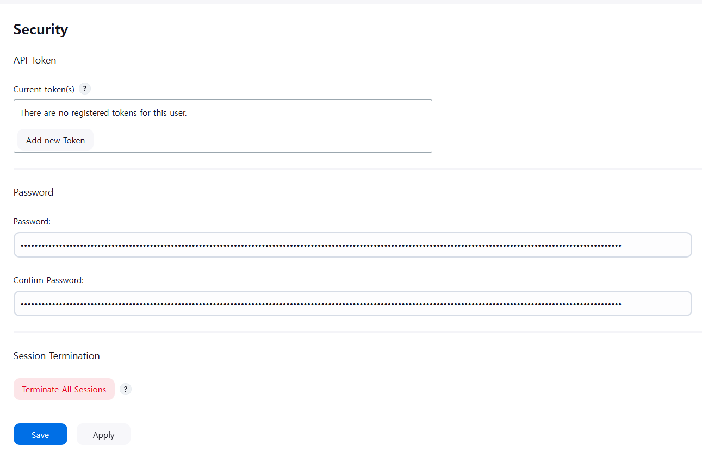

## 6. Jenkins Credential 생성
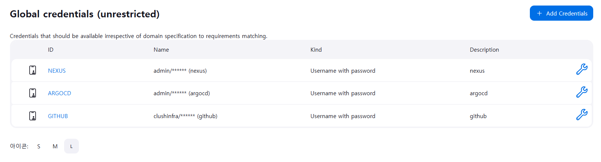

### Github
- Username : admin
- Password : 입력
- ID : GITHUB

### Nexus
- Username : admin
- Password : 입력
- ID : NEXUS

### ArgoCD
- Username : admin
- Password : 입력
- ID : ARGOCD

## 6. Jenkins Job 생성

https://github.com/clushinfra/workshop-cicd/blob/main/Jenkinsfile
해당 Jenkins 파일을 사용해 파이프라인을 생성할 예정입니다.

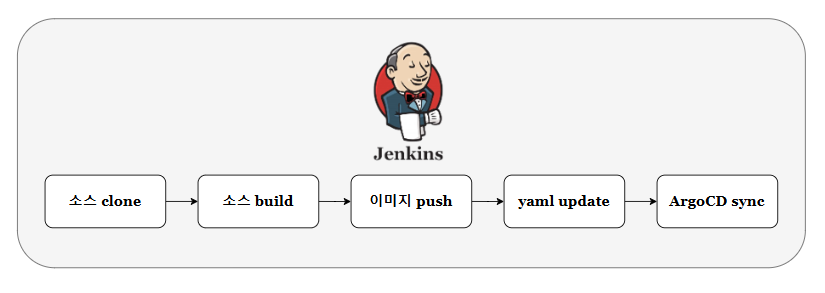

### 매개변수 등록
---
**1) SERVER_PUBLIC_IP**

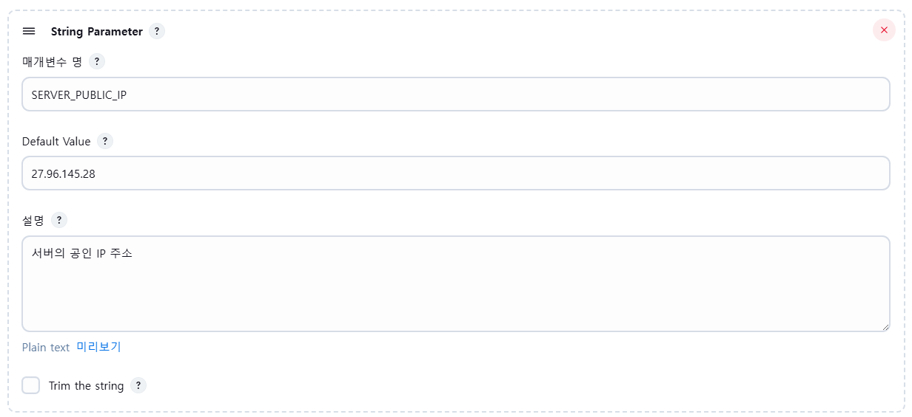

- 매개변수 명 : ```SERVER_PUBLIC_IP```
- Default Value : ```서버 공인 IP```
---
**2) SOURCE_GIT_URL**

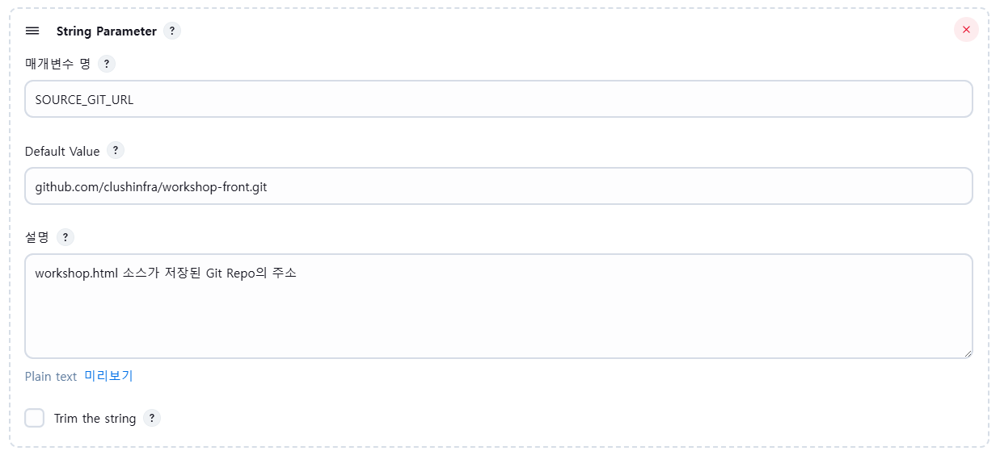

- 매개변수 명 : ```SOURCE_GIT_URL```
- Default Value : ```github.com/clushinfra/workshop-front.git```
---
**3) SOURCE_BRANCH**

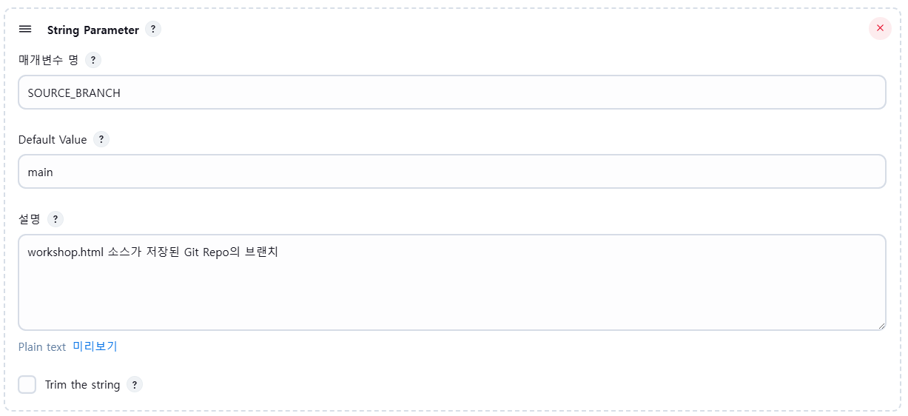

- 매개변수 명 : ```SOURCE_BRANCH```
- Default Value : ```main```
---
**4) CICD_GIT_URL**

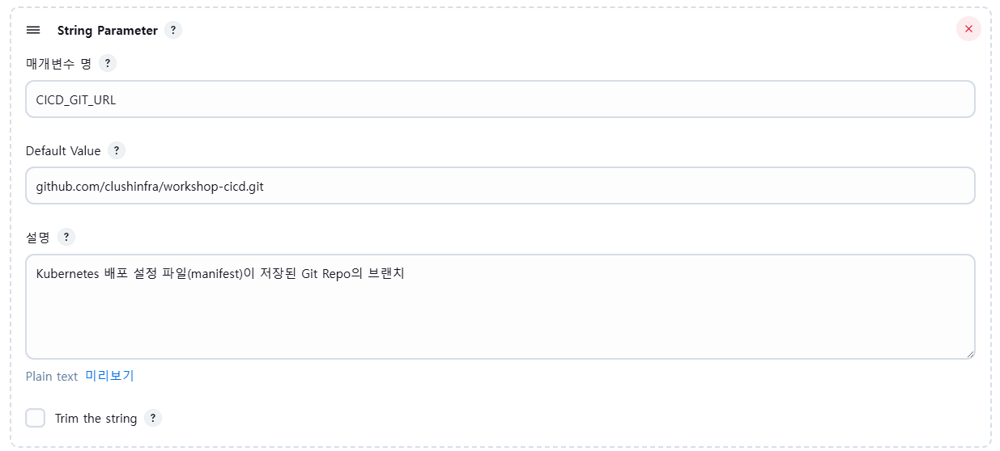

- 매개변수 명 : ```CICD_GIT_URL```
- Default Value : ```github.com/clushinfra/workshop-cicd.git```
---
**5) CICD_BRANCH**

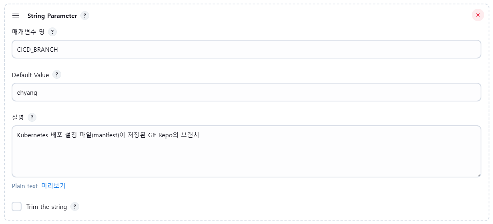

- 매개변수 명 : ```CICD_BRANCH```
- Default Value : ```메일 ID```
---
**6) DEPLOY_APP_NAME**

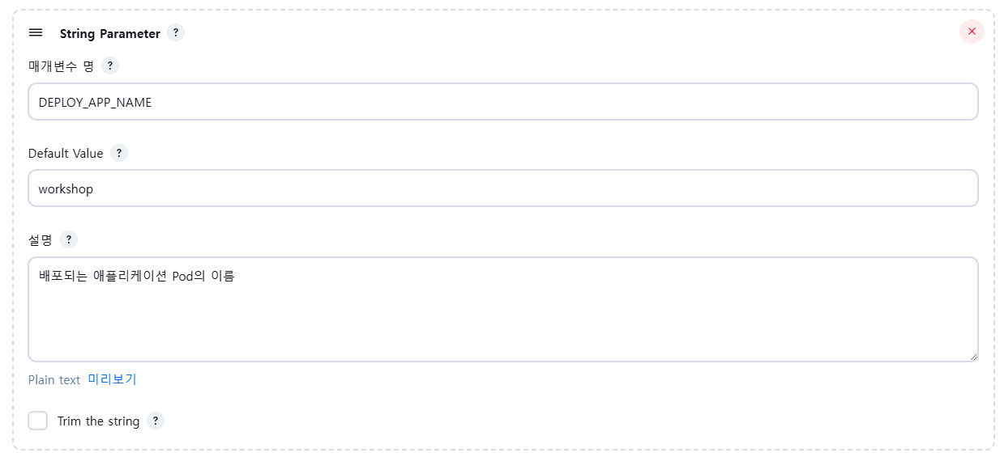

- 매개변수 명 : ```DEPLOY_APP_NAME```
- Default Value : ```workshop```
---
**7) NS**

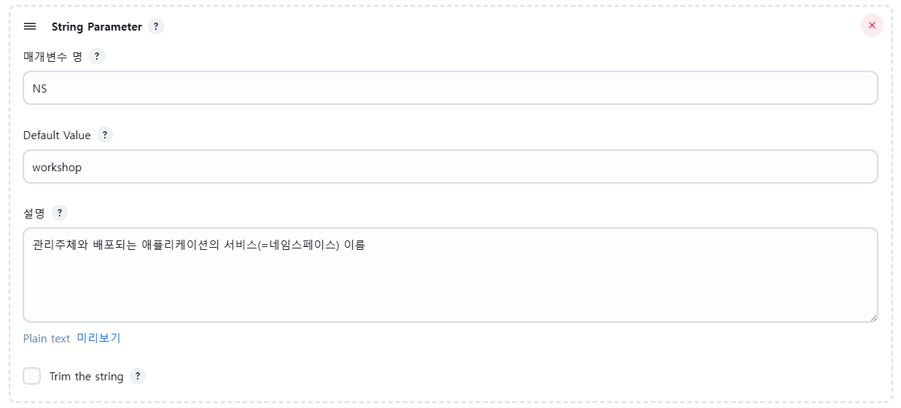

- 매개변수 명 : ```NS```
- Default Value : ```workshop```
---
**8) CLUSTER**

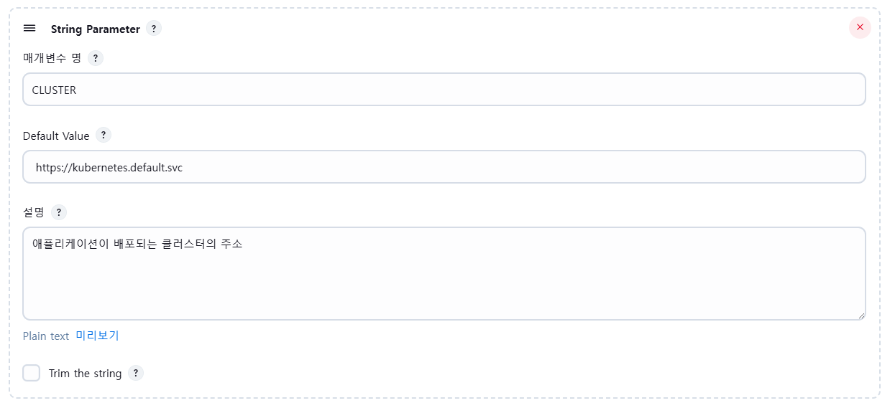

- 매개변수 명 : ```CLUSTER```
- Default Value : ```https://kubernetes.default.svc```
---
**9) DOCKER_BASE_IMAGE**

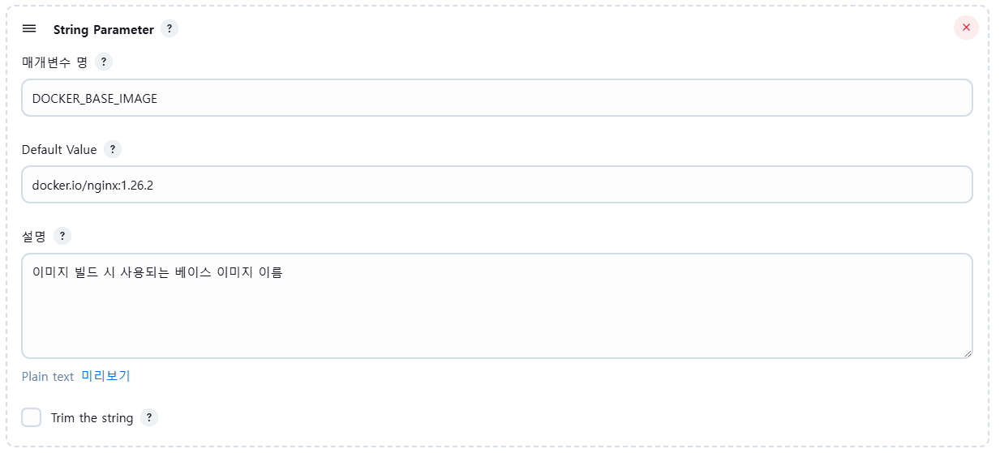

- 매개변수 명 : ```DOCKER_BASE_IMAGE```
- Default Value : ```docker.io/nginx:1.26.2```
---
**10) DOCKER_DEPLOY_PORT**

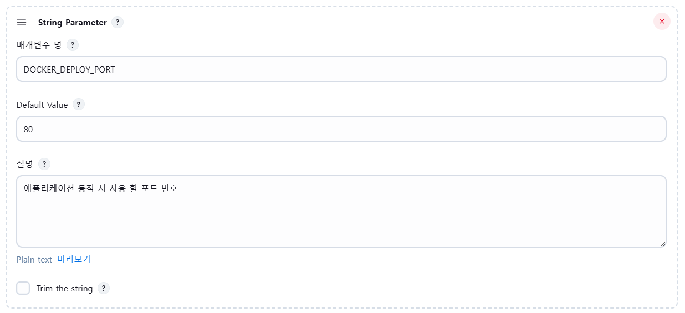

- 매개변수 명 : ```DOCKER_DEPLOY_PORT```
- Default Value : ```80```
---
### Pipeline 등록

- Repository URL : ```https://github.com/clushinfra/workshop-cicd.git```
- Credentials : ```github credential 사용```
- Branch : ```main```
- Script Path : ```Jenkinsfile```

## 7. 배포 확인


# 5. Prometheus + Grafana 생성
**Prometheus**란?

쿠버네티스 클러스터나 애플리케이션의 상태와 지표(Metrics)를 수집하는 모니터링 도구입니다.

**Grafana**란?

Prometheus가 수집한 데이터를 그래프나 대시보드로 시각화해 보여주는 도구입니다.


```bash
# helm 설치
curl https://raw.githubusercontent.com/helm/helm/main/scripts/get-helm-3 | bash

# 버전 확인
helm version

# repo 등록
helm repo add prometheus-community https://prometheus-community.github.io/helm-charts

# repo 업데이트
helm repo update

# namespace 생성
k create namespace monitoring

# 다운로드
helm install kube-prometheus-stack prometheus-community/kube-prometheus-stack   -n monitoring   --set prometheus.prometheusSpec.maximumStartupDurationSeconds=300

# 비밀번호 조회
k --namespace monitoring get secrets kube-prometheus-stack-grafana   -o jsonpath="{.data.admin-password}" | base64 -d && echo

# Grafana Pod의 이름을 자동으로 찾아서 POD_NAME이라는 변수에 저장하는 작업
export POD_NAME=$(kubectl -n monitoring get pod \
  -l "app.kubernetes.io/name=grafana,app.kubernetes.io/instance=kube-prometheus-stack" \
  -o name)
  
# NodePort로 변경
kubectl patch svc kube-prometheus-stack-grafana -n monitoring \
  -p '{"spec": {"type": "NodePort", "ports": [{"port": 80, "targetPort": 3000, "nodePort": 30083}]}}' 
```

접속 URL

<서버공인IP>:31103/

ID : admin

PW : 초기 비밀번호

# 추가적으로 한 부분

**젠킨스 크레덴셜(nexus) 생성**
